# MeerK40t — User Interface Manual (Meerkat workspace edition)

**Version:** 1.1 (2026-06-03)  
**Based on:** MeerK40t **v0.9.9000** on your PC, device **GRBL-DLC32-400**  
**Screenshots:** `images/meerk40t-ui-manual/` (copied from `Pictures\Screenshots\Meerk40T`)  
**Audience:** Andre van der Westhuizen — GRBL / MKS DLC32 CO2 workflow

---

## About this manual

This document explains **what you see and click** in MeerK40t. It combines **source-code accuracy** with **your real screenshots** (June 2026 capture session).

### Screenshot files

| Location | Contents |
|----------|----------|
| `images/meerk40t-ui-manual/*.png` | **28 named** images used in this manual |
| `images/meerk40t-ui-manual/full-screens/` | All 19 originals from **Full screens** |
| `images/meerk40t-ui-manual/menu/` | All 52 originals from **Menu** |

**PDF:** Install [Pandoc](https://pandoc.org/installing.html), then run `docs/meerk40t/scripts/build-ui-manual-pdf.ps1` → `docs/meerk40t/MeerK40t-UI-Manual.pdf`.

Image paths in this file use `../../images/meerk40t-ui-manual/` (relative to `docs/meerk40t/`).

### Related docs in this project

| Doc | Topic |
|-----|--------|
| [05-gui-architecture.md](05-gui-architecture.md) | Code-level GUI map |
| [07-planner-and-spooler.md](07-planner-and-spooler.md) | Cut plans, spooler |
| [11-core-elements-and-io.md](11-core-elements-and-io.md) | Elements tree, undo |
| [14-console-quickref.md](14-console-quickref.md) | Console commands |
| [17-meerkat-dlc32-workflow.md](17-meerkat-dlc32-workflow.md) | Your DLC32 burn workflow |

---

## Table of contents

0. [Illustrated walkthrough (your screenshots)](#0-illustrated-walkthrough-your-screenshots)
1. [Big picture](#1-big-picture-how-meerk40t-is-organized)
2. [Starting the application](#2-starting-the-application)
3. [Main window layout](#3-main-window-layout)
4. [Menus](#4-menus)
5. [Dockable panes](#5-dockable-panes)
6. [Scene (work area)](#6-scene-work-area)
7. [Drawing and editing tools](#7-drawing-and-editing-tools)
8. [Elements tree](#8-elements-tree)
9. [Operations tree and classification](#9-operations-tree-and-classification)
10. [Properties](#10-properties)
11. [Laser panel and job control](#11-laser-panel-and-job-control)
12. [Navigation and jogging](#12-navigation-and-jogging)
13. [Planner, spooler, simulation](#13-planner-spooler-simulation)
14. [Material Test and Material Manager](#14-material-test-and-material-manager)
15. [Device Manager and Configuration](#15-device-manager-and-configuration)
16. [Console](#16-console)
17. [Auxiliary windows](#17-auxiliary-windows-reference)
18. [View options and display modes](#18-view-options-and-display-modes)
19. [Network menu](#19-network-menu)
20. [Status bar](#20-status-bar)
21. [End-to-end workflow](#21-end-to-end-workflow-import-to-burn)
22. [GRBL / DLC32 UI notes](#22-grbl--mks-dlc32-ui-notes)
23. [Troubleshooting the UI](#23-troubleshooting-the-ui)
24. [Screenshot file index](#24-screenshot-file-index)

---

## 0. Illustrated walkthrough (your screenshots)

Your session used project **example edit** with **Sketch31.dxf** (MKS DLC32 screen cover) loaded. Below maps **your PNGs** to what each screen does.

### 0.1 Main window — everything at a glance

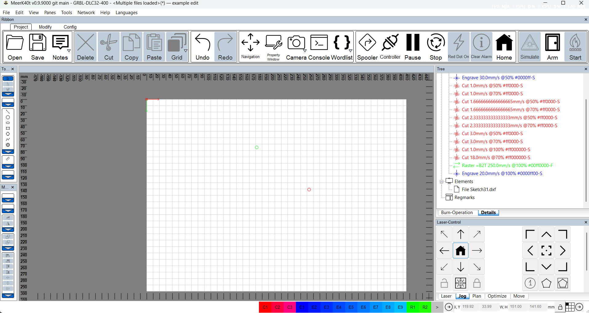

| Area | What you see | What it does |
|------|----------------|--------------|
| **Title bar** | `MeerK40t v0.9.9000` · `GRBL-DLC32-400` · `example edit` | Active device profile and project name |
| **Menu bar** | File, Edit, View, Panes, Tools, Network, Help, Languages | All top-level commands |
| **Ribbon → Project** | Open, Save, Undo, Navigation, Console, Spooler, Home, **Arm**, **Start** | Daily shortcuts (see §0.2) |
| **Ribbon → Modify** | Group, **Ungroup**, **Path Combine**, **Path Break Apart**, booleans, flip, rotate | **Unmerge** = **Path Break Apart** (after Combine) |
| **Left toolbars** | Draw shapes + align/distribute | Create and lay out art |
| **Scene (center)** | Grid, mm rulers, red/green origin | Bed preview; click to select |
| **Tree (right)** | Operations · Elements · Regmarks | Job logic + file list |
| **Laser-Control** | Jog tab, arrows, Home, keypad | Move head without burning |
| **Color bar (bottom)** | C1–C3, E1–E9, R1–R2 | Quick color → operation mapping |

**Typical burn path:** classify shapes → **Queue** (Laser/Plan tab or Spooler) → **Simulate** → **Connect** → **Home** → **Arm** → **Start**.

---

### 0.2 Ribbon — Project tab

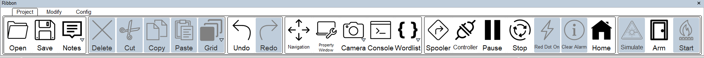

| Button | When to use |
|--------|-------------|
| **Open / Save / Notes** | Project file (SVG) and job notes |
| **Undo / Redo** | After merge, move, delete — **Ctrl+Z** undoes **Merge elements** |
| **Navigation** | Opens full Navigation window (§0.8) |
| **Console** | Type `$101=172`, `$HY`, `$$`, `plan… spool` |
| **Spooler** | See queued jobs (§0.10) |
| **Controller** | Live GRBL status |
| **Pause / Stop** | During a job |
| **Clear Alarm** | After GRBL `ALARM` — then fix cause, often `$X` in console |
| **Home** | Homing cycle (your profile: sequential **$HY** then **$HX**) |
| **Simulate** | Path preview before burning (§0.11) |
| **Arm** | Software enable before fire |
| **Start** | Run spooled job (grey until ready) |

**Modify tab** (on main window shot): **Path Break Apart** splits combined paths; **Ungroup** splits groups only.

---

### 0.3 Menus you captured

**File**

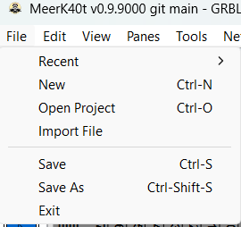

- **Import File** — how **Sketch31.dxf** entered the project (keep **Open Project** for full `.svg` saves).

**Edit**

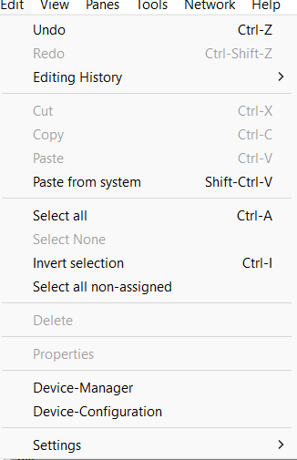

- **Device-Manager** / **Device-Configuration** — profiles and **GRBL-DLC32-400** settings.
- **Select all non-assigned** — finds shapes that will **not** burn.

**View → GUI Appearance / Render-Options**

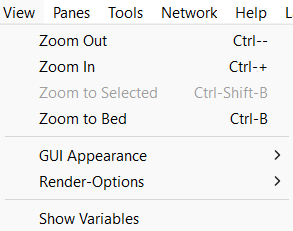

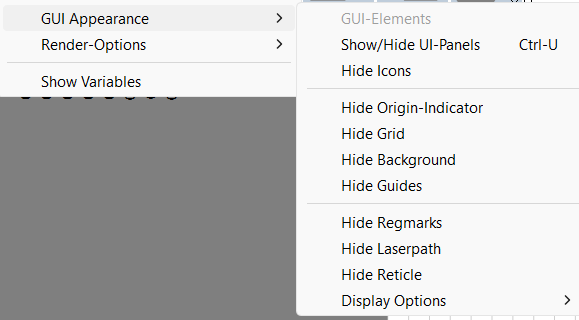

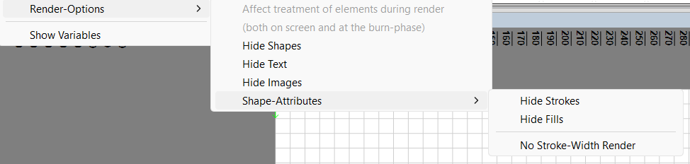

- **Ctrl+U** — show/hide all panels.
- **Hide laserpath / grid / reticle** — troubleshooting display only.
- **Render-Options** can affect burn preview — change carefully.

**Panes**

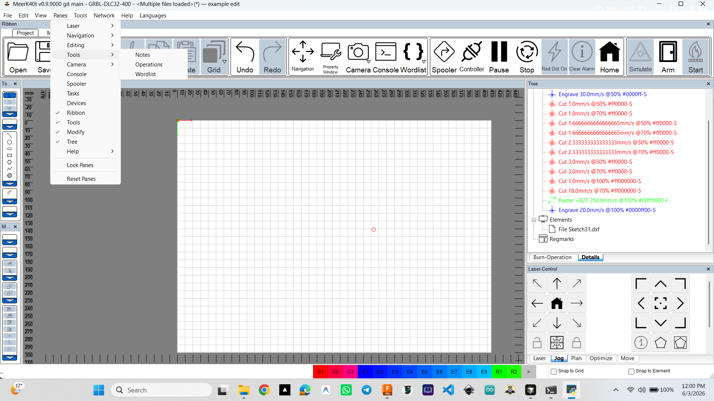

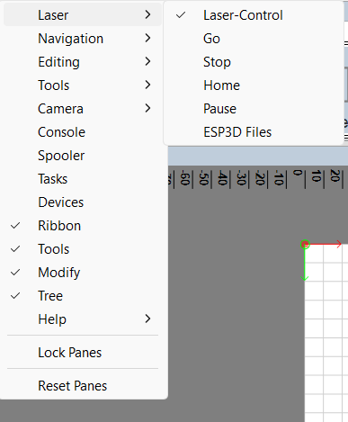

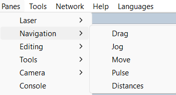

- Checked: **Ribbon**, **Tools**, **Modify**, **Tree**, **Laser-Control**.
- **Reset Panes** if a window disappears off-screen.

**Tools**

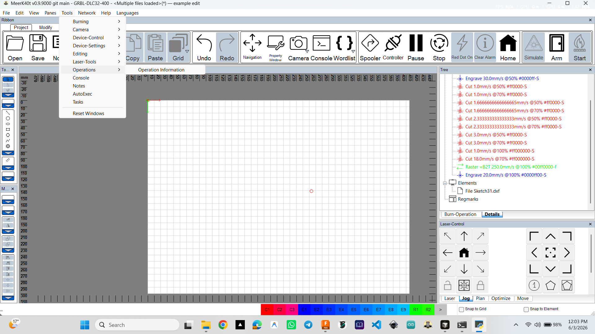

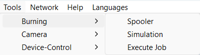

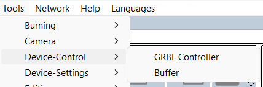

| Submenu | Opens |
|---------|--------|
| **Burning** | Spooler, Simulation, Execute Job |
| **Device-Control** | **GRBL Controller**, **Buffer** (lines queued to board) |
| **Editing** | Parameter-Test, Kerf-Test, Alignment, templates, … |
| **Camera** | Webcam overlay (optional) |

---

### 0.4 Import artwork (DXF)

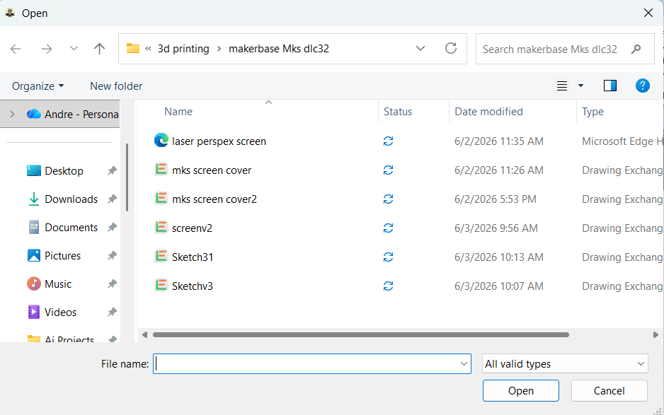

You browsed `makerbase Mks dlc32` and selected **Sketch31.dxf**. After import, the file appears under **Elements → File Sketch31.dxf** in the Tree.

---

### 0.5 Operations tree — what will burn

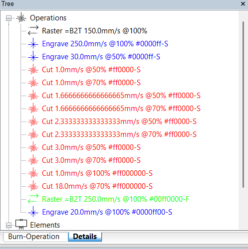

- **Operations** run top to bottom (before global optimize).
- Your list includes many **Cut** speeds (1–18 mm/s) and **Engrave** / **Raster** lines.
- Label format: `Cut 3.0mm/s @ 50% #ff0000-S` = speed, power %, colour, stroke (**S**) vs fill (**F**).
- **Elements** holds the DXF; expand to select individual paths.

**Assign Operation** (right-click shape):

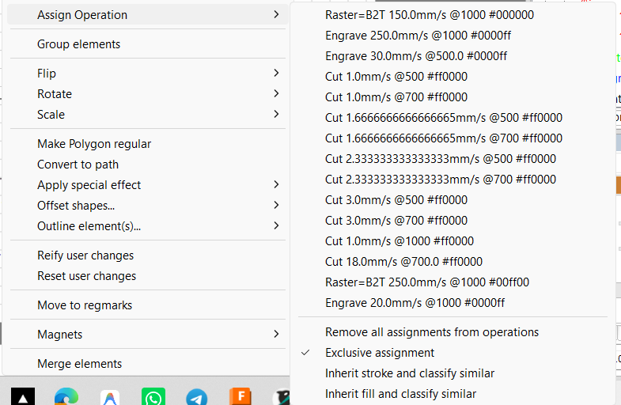

- Pick the Cut/Engrave line that matches your material test.
- **Exclusive assignment** ✓ — one operation per shape.
- **Inherit stroke/fill and classify similar** — auto-assign by colour.

**Operations** right-click — insert homing/wait:

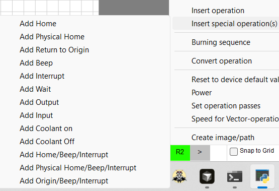

- **Add Physical Home** — use between passes if needed (you also have **Physical Home** at job end in config).

---

### 0.6 Scene — select, measure, context menu

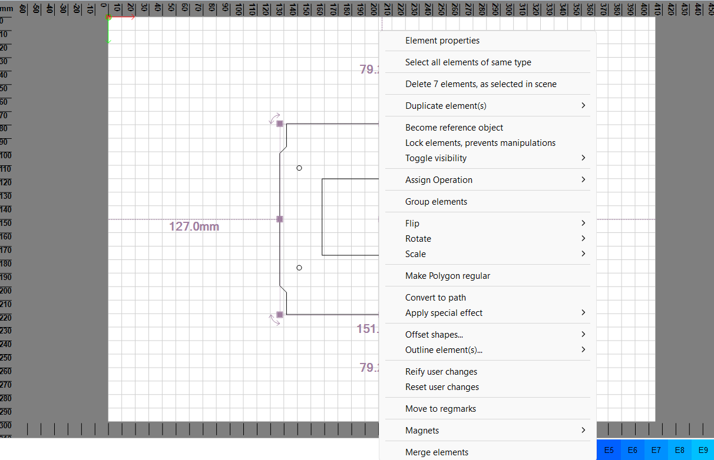

| Command | Purpose |
|---------|---------|
| **Element properties** | Stroke, fill, size |
| **Assign Operation** | Link to Cut/Engrave |
| **Group / Merge elements** | Combine selection |
| **Convert to path** | Editable nodes |
| **Reify / Reset user changes** | Apply or undo scale-rotate |

Purple handles = resize/rotate. Dimension labels (e.g. **127.0 mm**) show selection size on bed.

---

### 0.7 GRBL device configuration (your DLC32 profile)

**Device tab** — bed size and axis flip:

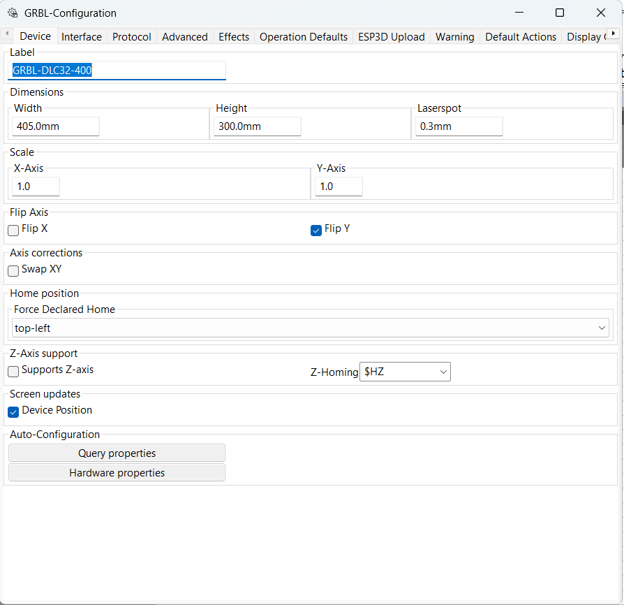

| Setting | Your value | Note |
|---------|------------|------|
| Label | GRBL-DLC32-400 | Matches title bar |
| Width × Height | 405 × 300 mm | Match `$130` / `$131` on board |
| Flip Y | ✓ | Matches machine (into bed = Y−) |
| Force home | top-left | After homing, origin top-left |

**Advanced tab** — homing and buffer (critical):

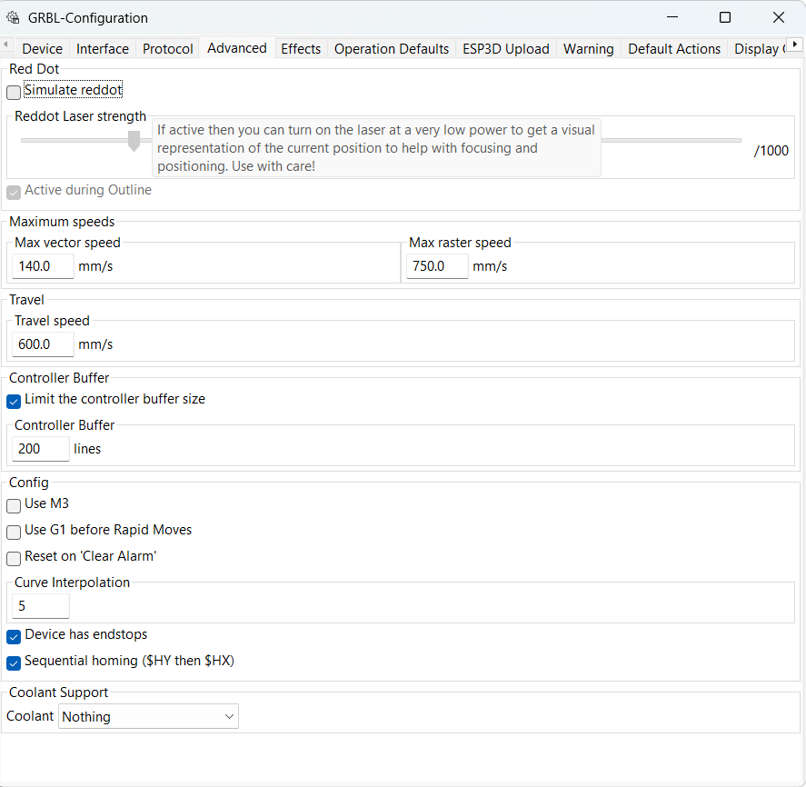

| Setting | Your value | Note |
|---------|------------|------|
| **Device has endstops** | ✓ | Required for your limit switches |
| **Sequential homing ($HY then $HX)** | ✓ | Avoid single **$H** on your machine |
| Controller buffer | 200 lines | WiFi/USB stability |

**Default Actions** — after every job:

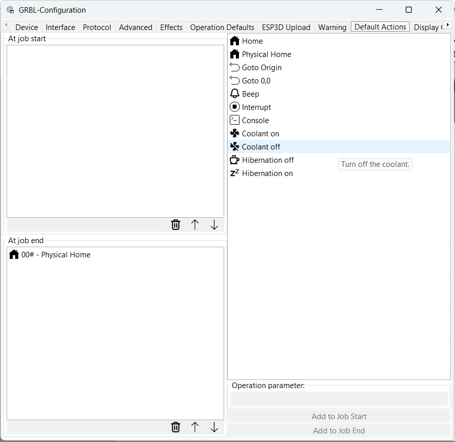

- **At job end:** `Physical Home` — head returns to switches.

**Other tabs captured:** Effects, Display Options — see `11c-grbl-config-effects.png`, `11e-grbl-config-display-options.png` in image folder.

Steps/mm calibration (**$100**, **$101**) is done in the **Console**, not on these tabs (Device **Scale** stays **1.0**).

---

### 0.8 Navigation window — jog, pulse, move

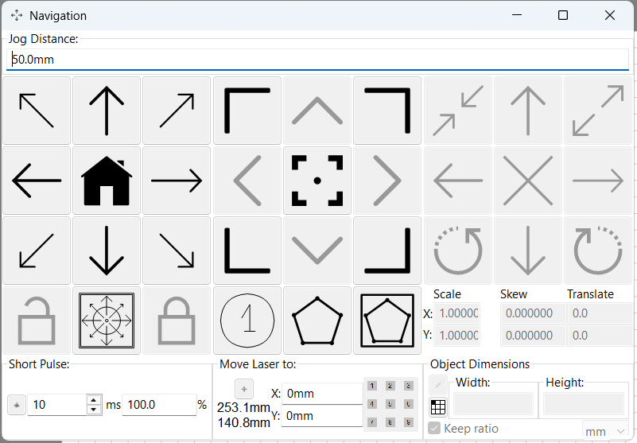

| Section | Use |
|---------|-----|
| **Jog distance** | e.g. **50 mm** for calibration moves |
| **Arrow pad + Home** | Manual jog; centre = home |
| **Short Pulse** | Brief beam for alignment (chiller + **WP** must be OK) |
| **Move laser to** | Type X/Y (your shot: ~253.1 / 140.8 mm) |
| **Scale / translate** | Numeric transform on selection |

Same jog controls exist in docked **Laser-Control → Jog** on the main window.

---

### 0.9 Material tuning tools

**Parameter-Test** — speed vs power grid:

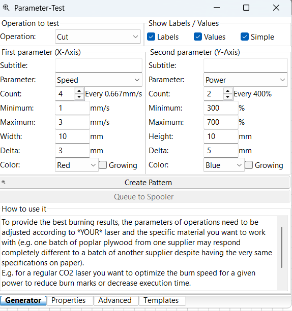

1. Set operation **Cut**, X = speed, Y = power.  
2. **Create Pattern** on bed.  
3. Burn → pick best square → apply to real Cut operation.  
4. **Queue to Spooler** sends grid to machine.

**Kerf-Test** — fit test pieces for beam width:

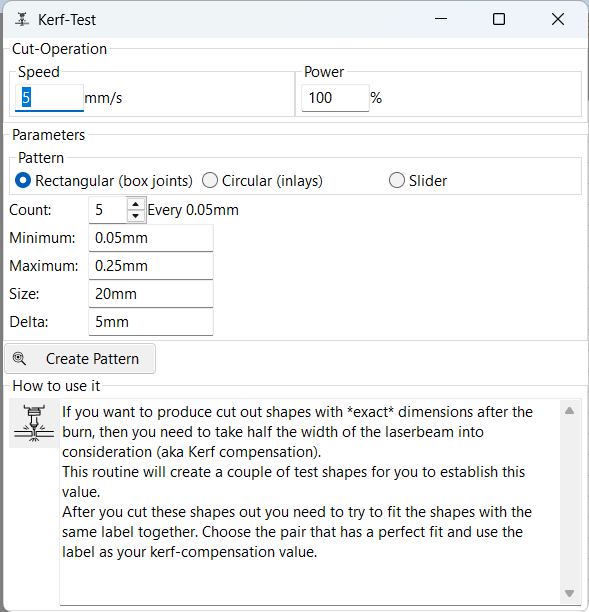

---

### 0.10 Job Spooler

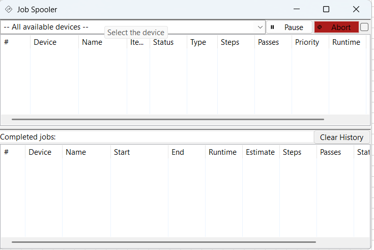

- **Top:** active queue — **Pause**, **Abort**.  
- **Bottom:** completed jobs history.  
- Empty tables = nothing queued yet (use **Queue** on Laser pane first).

---

### 0.11 Simulation before Start

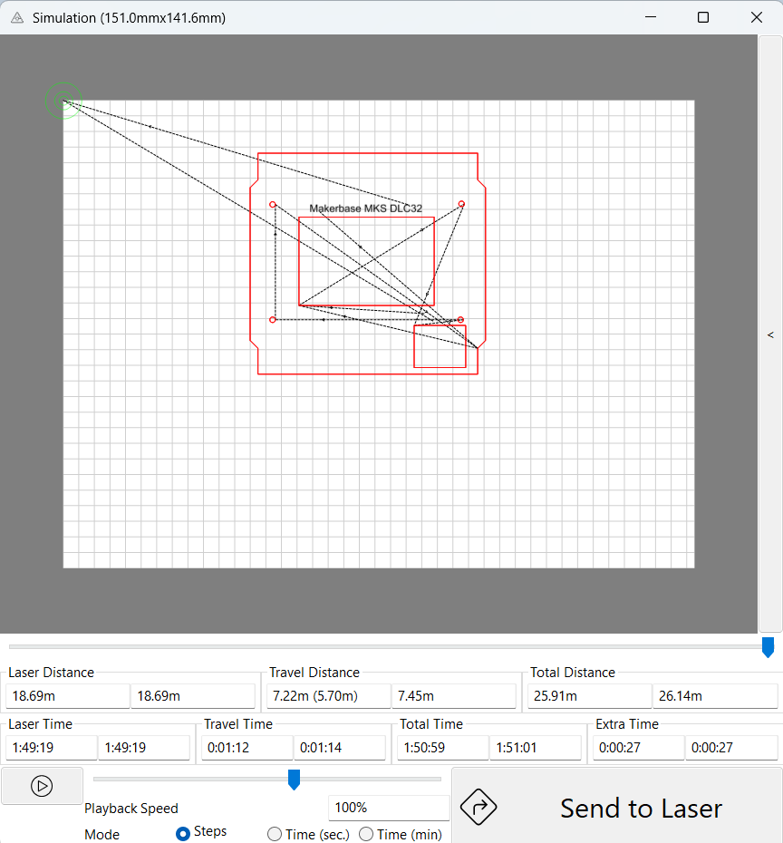

- **Red** = cutting; **dashed black** = travel (laser off).  
- Shows **laser time**, **travel time**, **total distance**.  
- Your job example: ~1 h 51 min total — use to decide if order is acceptable.  
- **Send to Laser** when satisfied (still need **Arm** + **Start** on main UI).

---

## 1. Big picture: how MeerK40t is organized

MeerK40t is built around a **kernel** (command processor) with a **graphical shell** on top.

```text
  ┌─────────────────────────────────────────────────────────────┐
  │  Menus · Ribbon · Status bar · Job buttons (Go/Stop/Home)   │
  ├──────────────┬──────────────────────────────┬───────────────┤
  │  Tree panes  │         SCENE                │ Laser / Nav   │
  │  Elements    │   (draw, select, preview)    │  (device)     │
  │  Operations  │                              │               │
  ├──────────────┴──────────────────────────────┴───────────────┤
  │  Console (commands, GRBL $ settings, errors)                 │
  └─────────────────────────────────────────────────────────────┘
```

**Three ideas to remember:**

1. **Elements** = what you drew or imported (geometry, text, images).
2. **Operations** = how the laser treats those elements (cut, engrave, raster, etc.).
3. **Device + Spooler** = connection to the controller and the queued job that actually runs.

Nothing burns until: shapes are **classified** into operations → plan is **built** → job is **spooled** → you **arm** and **start** (GRBL: connect first).


---

## 2. Starting the application

### Normal GUI

- Run MeerK40t from your install or `python -m meerk40t` from the clone.
- A **splash / busy** screen may appear while plugins load (`gui/plugin.py`).

### Simple UI (`-w` / `--simpleui`)

A reduced interface without the full main window. Use the full GUI for learning and for CO2 workflow.

### Persistence

- **Project** = saved as **SVG** (File → Save). Operations and elements live in that file.
- **Window layout** can be remembered (Window menu → reset option clears stored pane positions).
- **Device settings** live in MeerK40t config + often mirrored on the board (GRBL `$$`).

---

## 3. Main window layout

The main frame is class **`MeerK40t`** (`gui/wxmmain.py`). Layout uses **wxAUI** — panes dock, float, tab, and hide.

### Typical panes (defaults vary by profile)

| Pane | Role |
|------|------|
| **Scene** | Main bed view; draw and select here |
| **Ribbon** | Tool buttons (line, rect, edit nodes, …) |
| **Tree** | Elements + Operations tabs |
| **Laser** | Device, connect, arm, start, plan/spool |
| **Console** | Type commands; see GRBL traffic |
| **Position** | Cursor / selection coordinates |
| **Go / Stop / Pause / Home** | Quick job and homing buttons (often in toolbar) |

Open or hide panes: **View** menu and **Pane** submenu (dynamic list of registered `wxpane/*` panels).

### Title bar

Shows project name, device name, and status hints (connection, alarms). Exact format depends on version and connection state.

---

## 4. Menus

### 4.1 File

| Item | Shortcut | What it does |
|------|----------|--------------|
| **New** | Ctrl+N | Clears operations, elements, notes (fresh project) |
| **Open Project** | Ctrl+O | Replaces project from SVG; **Shift** = pick folder |
| **Import File** | — | Adds file into current project (SVG, DXF, images, …) |
| **Save** | Ctrl+S | Overwrite current SVG project |
| **Save As** | Ctrl+Shift+S | Save under new name |
| **Recent** | — | Recent projects (not on some frozen macOS builds) |
| **Exit** | — | Quit application |


**Tip:** Your machine workflow often uses **Import** for artwork and **Save** before every long burn session.

---

### 4.2 Edit

| Item | Shortcut | What it does |
|------|----------|--------------|
| **Undo** | Ctrl+Z | Reverses last change (merge, move, delete, …) |
| **Redo** | Ctrl+Shift+Z | Restores undone change |
| **Editing History** | — | Submenu to jump to an earlier undo state |
| **Cut / Copy / Paste** | Ctrl+X/C/V | Clipboard inside MeerK40t |
| **Paste from system** | Shift+Ctrl+V | Paste from other apps (e.g. Illustrator paths) |
| **Select all** | Ctrl+A | Emphasize every element |
| **Select None** | — | Clear selection |
| **Invert selection** | Ctrl+I | Toggle selection |
| **Select all non-assigned** | — | Highlights shapes not in any operation |
| **Delete** | — | Remove selected tree items |
| **Properties** | — | Opens Properties window for selection |
| **Device-Manager** | — | Add/switch laser devices |
| **Device-Configuration** | — | Active device settings (GRBL port, speeds, …) |
| **Preferences** | — | Global GUI and behavior |
| **Wordlist** | — | Variable text lists |
| **Hershey Font Manager** | — | Stroke fonts for engraving |
| **Keymap** | — | Keyboard shortcut editor |


**Merge / unmerge:** There is no menu item named “Unmerge”. Use **Undo** after **Merge elements**, or right-click a path → **Break Subpaths** (see [§8](#8-elements-tree)).

---

### 4.3 View

Controls **what is drawn** on the scene and in the burn preview — not the laser hardware.

**GUI Appearance** (examples):

- Theme / colors
- Icon sizes
- Tooltip and overlay behavior

**Scene Appearance** (examples):

- **Hide Shapes / Text / Images** — toggles draw categories
- **Render-Options** — advanced: affects on-screen and burn-phase treatment (use carefully)
- **Show origin**, grid, guides, magnet targets
- **Show variable replacement** — preview wordlist substitutions in text


If the bed looks “empty” but the tree has items, check **Hide Shapes** and emphasis (selection).

---

### 4.4 Pane menu

Lists all registered dock panels (Console, Tree, Laser, Navigation sub-panes, Snap options, etc.). Check = visible.

---

### 4.5 Tool / Window menu (dynamic)

**Window** menu is built from registered `window/*` modules. Grouped entries open tools such as:

- Alignment, Simulation, Material Manager, Split Image, Kerf, Living Hinge, …

**Reset window positions** — restores default layout when panes are lost off-screen.

---

### 4.6 Network

| Service | Purpose |
|---------|---------|
| **Webserver** | Control MeerK40t from a browser (port in settings) |
| **Telnet / consoleserver** | Remote console |
| **GRBL-server** | Third-party apps talking GRBL through MeerK40t |
| **Ruida-server** | Same idea for Ruida |

*Network menu — not captured in this session; use menu bar **Network** for Webserver / Telnet / GRBL-server.*

---

### 4.7 Help

- Online help (context-sensitive where implemented)
- Offline help bundle (if shipped with your build)
- About, Tips window, links to wiki/GitHub

---

## 5. Dockable panes

Registered in `gui/wxmeerk40t.py` and related modules.

| Registration | User-facing role |
|--------------|------------------|
| `wxpane/ScenePane` | Scene container |
| `wxpane/Ribbon` | Tool ribbon |
| `wxpane/Tree` | Elements + Operations |
| `wxpane/LaserPanel` | Device + burn controls |
| `wxpane/Navigation` | Jog, pulse, transforms (sub-panes) |
| `wxpane/Position` | Live coordinates |
| `wxpane/opassign` | Quick operation assignment |
| `wxpane/Snap` | Snap distances and modes |
| `wxpane/magnet` | Magnetic alignment helpers |
| `wxpane/wordlist` | Wordlist quick access |
| `pane/console` | Console |
| `pane/laser` | Alternate laser strip |
| `pane/jog`, `pane/drag`, `pane/move`, `pane/pulse`, `pane/transform` | Navigation pieces |

**Drag pane title bars** to dock left/right/bottom or float. Right-click pane tab for hide/close.

---

## 6. Scene (work area)

The scene (`gui/wxmscene.py`, `gui/scene/scene.py`) is your **virtual bed**.

### Navigation in the scene

| Action | Typical input |
|--------|----------------|
| Pan | Middle-mouse drag or dedicated pan mode |
| Zoom | Mouse wheel or zoom tool |
| Select | Click shape; shift-click add; drag rectangle |
| Move selection | Drag selected objects |
| Resize / rotate | Handles when selection tool active |


### Emphasis vs selection

- **Emphasized** items (highlighted in tree) are what operations and Properties act on.
- Many menu items require `has_emphasis` (something selected).

### Bed size and origin

Comes from **device settings** (for GRBL: workspace size, origin corner). Scene grid should match `$130`/`$131` soft limits after calibration.

### Colors

Stroke/fill in scene reflect element attributes; operation colors may show in preview modes. **GuiColors** service drives themes.

---

## 7. Drawing and editing tools

Tools register under `tool/*` in `wxmscene.py`.

| Tool ID | Name (typical) | Use |
|---------|----------------|-----|
| `tool/draw` | Draw | Freehand paths |
| `tool/rect` | Rectangle | Boxes |
| `tool/line` | Line | Single segments |
| `tool/polyline` | Polyline | Connected segments |
| `tool/polygon` | Polygon | Closed polygon |
| `tool/circle` | Circle | Circles |
| `tool/ellipse` | Ellipse | Ellipses |
| `tool/point` | Point | Mark points |
| `tool/text` | Text | Text boxes |
| `tool/linetext` | Line text | Text along a line |
| `tool/vector` | Vector | Vector-specific ops |
| `tool/measure` | Measure | Distance measurement |
| `tool/relocate` | Relocate | Move job origin |
| `tool/placement` | Placement | Place imported art |
| `tool/edit` | Node Edit | Edit path points |
| `tool/nodemove` | Node Move | Move single nodes |
| `tool/pointmove` | Point Move | Fine point drag |
| `tool/parameter` | Parameter | Edit path parameters |
| `tool/imagecut` | Image cut | Cut contours from image |
| `tool/tabedit` | Tab edit | Tabs for mechanical parts |
| `tool/ribbon` | Ribbon | Meta-tool on ribbon bar |


### Node Edit tool (important)

- Select a **path** → activate **Node Edit**.
- Click points; drag handles for Bézier control.
- **Break** (`b` key in tool): split path at selected point(s) — different from **Break Subpaths** in tree.
- **Insert** / **Delete** points as needed for cleanup after import.

*Node Edit tool — activate from left toolbar; use **Break** on a point to split a path (see §0.1 Modify ribbon **Path Break Apart** for combined paths).*

---

## 8. Elements tree

Left tree tab **Elements** lists all geometry groups.

### Structure

- **Group** — folder-like container
- **elem path**, **elem rect**, **elem image**, **elem text**, … — leaf types
- **Regmark** / guide layers may appear depending on profile

### Right-click (context) actions (common)

Exact list depends on node type and lock state. Examples from `element_treeops.py`:

| Action | Effect |
|--------|--------|
| **Merge elements** | Multiple shapes → one **path** (undo: Ctrl+Z) |
| **Break Subpaths** | One path → group of separate paths |
| **Merge items** (on group) | Children → single path |
| **Lock / Unlock** | Prevent edits |
| **Copy / Paste** | Duplicate subtrees |
| **Classify** | Auto-assign to operations |
| **Ungroup** | Split group |
| **Reorder** (up/down) | Tree order (can affect burn order before planner) |


### Merge vs Break Subpaths (recap)

- **Merge** = design choice to combine geometry.
- **Break Subpaths** = splits **disconnected** contours inside one path into separate elements.
- Stitched contours (shared endpoints) may stay one path until you **Break** in node edit or Undo merge.

---

## 9. Operations tree and classification

Second tab **Operations** defines **Cut**, **Engrave**, **Raster**, **Image op**, **Dots**, etc.

### Concepts

| Term | Meaning |
|------|---------|
| **Operation** | Laser settings + rules for a set of shapes |
| **Classification** | Linking elements → operations (stroke color, fill, automatic rules) |
| **Re-Classify** | Re-run rules after you change art |
| **Unassigned** | Shapes not in any operation — **will not burn** |


### Typical CO2 workflow

1. Create **Cut** operation (speed, power, passes).
2. Import or draw art.
3. **Classify** (drag-drop or automatic).
4. Open **Operation Properties** — confirm power/speed, **dot length**, **frequency** (device dependent).
5. If inner holes skip: enable **Fill** on Cut op or assign inner paths to Cut (see [17-meerkat-dlc32-workflow.md](17-meerkat-dlc32-workflow.md)).

### Planner options (in device/plan config)

- **Merge Operations** / **Merge Passes** — optimizes order at spool time; does **not** merge shapes in the scene.

---

## 10. Properties

**Window → Properties** or Edit → Properties.

Two contexts:

1. **Element properties** — position, size, stroke, fill, font, image DPI, etc.
2. **Operation properties** — power, speed, passes, kerf, dithering, raster direction, GRBL-specific tabs from driver plugins.

*Properties window — open via **Edit → Properties** or right-click **Element properties** (not in this screenshot set).*

Changes apply to **emphasized** items. Multi-selection may show common fields only.

---

## 11. Laser panel and job control

The **Laser** pane (`gui/laserpanel.py`) is the control center for the active device.

### Main controls (typical)

| Control | Role |
|---------|------|
| **Device selector** | Which configured laser profile |
| **Connect / Disconnect** | Open serial/TCP to controller |
| **Arm** | Permit firing (safety interlock in software) |
| **Start / Execute** | Run spooled job |
| **Pause / Resume** | Pause motion |
| **Stop / E-Stop** | Halt job and reset planner state |
| **Queue / Plan** | Build cut plan and spool |
| **Hold** | Reuse last plan without full rebuild (when blob exists) |
| **Update plan** | Refresh plan after edits |


### Safe sequence (GRBL)

1. Chiller / **`WP`** interlock satisfied.  
2. **Connect**.  
3. **Home** (`$HY` then `$HX` on your machine — use Navigation or configured home buttons).  
4. **Queue** job (checks unassigned shapes).  
5. **Arm** → **Start**.  

### Unassigned warning

When queueing, MeerK40t may warn that some shapes are not assigned — inner detail may be skipped. Read the dialog; fix via Re-Classify or drag to Cut.

*Unassigned-shapes warning — appears when queueing if shapes are not in any operation (see §0.5).*

### Toolbar job buttons

- **Go** — start/spool depending on context  
- **Stop** — emergency stop icon  
- **Home** — homing cycle  
- **Pause** — pause spooler  

Colors follow **themes** (arm = caution, stop = red).

---

## 12. Navigation and jogging

**Window → Navigation** opens jog controls.

| Sub-panel | Function |
|-----------|----------|
| **Jog** | Direction buttons, continuous jog |
| **Jog distance** | Step size (1 mm, 10 mm, 100 mm, …) |
| **Move** | Go to absolute X/Y |
| **Pulse** | Short laser fire for alignment (with caution) |
| **Transform** | Scale/rotate selection numerically |
| **Drag** | Drag-style positioning |


**GRBL note:** Jog moves use controller jog mode; calibrate `$100`/`$101` using real measurements (see [16-mks-dlc32-board.md](16-mks-dlc32-board.md)).

**Confined coordinates:** MeerK40t may limit jog to bed — if jog “stops early”, check soft limits and homing.

---

## 13. Planner, spooler, simulation

### Cut plan pipeline (conceptual)

```text
  Elements + Operations
        → copy → preprocess → validate → blob → [optimize] → spool
        → LaserJob on device spooler
```

### Job Spooler window

**Window → Job Spooler** — list of queued jobs, progress, cancel.


### Simulation window

**Window → Simulation** — preview path order, travels, timing estimate.


### Execute Job / Thread Info

Long plans may open **Thread Info** when threaded planning is enabled — shows background planner progress.

*Execute Job / Thread Info — opens during long plan builds (Tools → Burning).*

---

## 14. Material Test and Material Manager

| Window | Purpose |
|--------|---------|
| **Material Manager** | Library of power/speed presets per material |
| **Material Test** | Grid of test burns (power/speed matrix) |

Used heavily in [17-meerkat-dlc32-workflow.md](17-meerkat-dlc32-workflow.md).

*Material Manager — Tools → Editing (not captured).*


After a test grid: pick best cell → apply settings to operation → queue real job.

---

## 15. Device Manager and Configuration

### Device Manager

**Edit → Device-Manager** — create profiles: **GRBL**, Lihuiyu, Ruida, Balor, …

*Device Manager — Edit → Device-Manager (not captured).*

For DLC32 you typically have one **GRBL** device:

- Connection: **USB COM** or **TCP** `192.168.x.x:8080` (WiFi bridge)
- Baud: often **115200** USB
- Options: **has endstops**, **sequential homing**, connect delay

### Device Configuration

**Edit → Device-Configuration** — speeds, bed size, flip flags, GRBL `$` passthrough, controller behavior.


See also §0.7 for **Advanced** and **Default Actions** screenshots.

**Writing `$$`:** Console shows `ok` per line. A **PermissionError** on “WriteFile” is MeerK40t failing to save a log on **PC** — not always a board reject. Confirm with `$$` readback.

---

## 16. Console

Bottom **Console** pane — full command language.

### Uses

- Run planning: `plan0 clear copy preprocess validate blob spool`
- Element ops: `element merge`, `element subpath`
- GRBL: `$101=172`, `$HY`, `$HX`, `?`, `$X` unlock
- Window: `window open Simulation`

*Console pane — open from Ribbon **Console** or Panes menu (not captured; use for `$100`, `$101`, `$$`).*

See [14-console-quickref.md](14-console-quickref.md). Type `help` and `help <command>` for discovery.

---

## 17. Auxiliary windows (reference)

Registered in `gui/wxmeerk40t.py` (open via **Window** menu or console):

| Window | Typical use |
|--------|-------------|
| **MeerK40t** | Main frame (this manual) |
| **Properties** | Edit selection |
| **Console** | Commands |
| **Preferences** | Global settings |
| **About** | Version |
| **Keymap** | Shortcuts |
| **Wordlist** | Parametric text |
| **MatManager** | Materials library |
| **Navigation** | Jog / pulse |
| **Notes** | Project notes |
| **AutoExec** | Commands on events |
| **JobSpooler** | Queue |
| **ThreadInfo** | Planner threads |
| **Simulation** | Path preview |
| **Tips** | Daily tips |
| **ExecuteJob** | Job execution UI |
| **BufferView** | Driver buffer debug |
| **Scene** | Secondary scene view |
| **DeviceManager** | Devices |
| **Alignment** | Align objects to each other / bed |
| **HersheyFontManager** | Fonts |
| **HersheyFontSelector** | Pick font |
| **SplitImage** | Large raster tiling |
| **OperationInfo** | Operation summary |
| **Lasertool** | Laser-specific utilities |
| **Templatetool** | Templates |
| **Hingetool** | Living hinge patterns |
| **Kerftest** | Kerf compensation tests |
| **SimpleUI** | Minimal UI |
| **CameraInterface** | Camera overlay (if plugin loaded) |

*Alignment window — Tools → Editing (not captured).*

---

## 18. View options and display modes

**View → Scene Appearance** toggles bits in `draw_mode`:

- Hide categories (paths, text, images)
- Hide effects / non-burn layers
- Show magnets, grid, origin
- Variable preview for wordlists

**Render-Options** affect how fills and vectors are interpreted at **render and burn** — only change when you understand the planner impact.

---

## 19. Network menu

Start/stop embedded servers (see [§4.6](#46-network)). Useful for phone/tablet control on same LAN — secure your network; anyone on the port can send commands.

---

## 20. Status bar

Widgets along the bottom (`gui/statusbarwidgets/`):

| Widget area | Info |
|-------------|------|
| **Selection** | Count, size of selection |
| **Position** | Mouse / tool position |
| **Operation assign** | Quick assign emphasized → op |
| **Stroke/fill** | Quick style readout |
| **Job progress** | Spooler step fraction during burn |


---

## 21. End-to-end workflow: import to burn

1. **File → Import** artwork (SVG/DXF).  
2. Check scale and position on scene.  
3. Ensure **Cut** (and **Engrave** if needed) operations exist.  
4. **Classify** or manual drag to operations.  
5. **Device-Configuration** — connect type, bed size.  
6. **Connect** on Laser pane.  
7. **Home** machine.  
8. **Pulse** / low power + jog → align to material corner.  
9. **Queue** plan (fix unassigned if warned).  
10. **Simulation** — optional but recommended for order/travel.  
11. **Arm** → **Start**.  
12. Monitor spooler; **Stop** if something wrong.  

---

## 22. GRBL / MKS DLC32 UI notes

Specific to your setup ([16-mks-dlc32-board.md](16-mks-dlc32-board.md), [17-meerkat-dlc32-workflow.md](17-meerkat-dlc32-workflow.md)):

| Topic | UI behavior |
|-------|-------------|
| **Homing** | Prefer **$HY** then **$HX**; avoid single **$H** |
| **Touch panel jog** | Same GRBL `$100`/`$101` as MeerK40t — calibrate with ruler |
| **Laser test on panel** | Short beam normal with `$32=1` (no motion) — use MeerK40t **Pulse** for steady test |
| **WiFi** | TCP device in MeerK40t; dropouts freeze progress — USB for long jobs |
| **ALARM:1** | Console `$X`, check `?` → `Pn:`; fix limits/jumpers |

---

## 23. Troubleshooting the UI

| Symptom | Things to check |
|---------|------------------|
| Panes missing | View/Pane menu; Window → reset positions |
| Cannot click Start | Connect? Arm? Spool empty? Unassigned shapes? |
| Scene empty | Hide Shapes on; zoom extents; wrong emphasis |
| GRBL `$` won’t save | One client per port; use console `ok`; ignore PC WriteFile error if `$$` shows new values |
| Inner shapes skip | Operations tree — assign + Fill on Cut |
| Merge can’t undo | Break Subpaths or node Break |
| Slow UI | Large images; suppress non-visible elements in Preferences |

---

## 24. Screenshot file index

**Source (your PC):** `C:\Users\User\Pictures\Screenshots\Meerk40T\`  
**Copied to repo:** `images/meerk40t-ui-manual/`

### Named images (used in §0)

| File | Description |
|------|-------------|
| `01-main-window.png` | Full UI, GRBL-DLC32-400, Sketch31 project |
| `02-file-menu.png` | File menu |
| `03-ribbon-project-tab.png` | Ribbon Project tab |
| `04-scene-context-menu.png` | Scene selection + right-click |
| `05-operations-tree.png` | Operations / Elements tree |
| `07-navigation.png` | Navigation window |
| `11-grbl-config-device.png` | GRBL Configuration — Device |
| `11b-grbl-config-advanced.png` | GRBL Configuration — Advanced |
| `11c-grbl-config-effects.png` | GRBL Configuration — Effects |
| `11d-grbl-config-default-actions.png` | Default Actions at job end |
| `11e-grbl-config-display-options.png` | Display Options |
| `13-job-spooler.png` | Job Spooler |
| `14-simulation.png` | Simulation preview |
| `16-parameter-test.png` | Parameter-Test generator |
| `18-view-menu.png` | View menu |
| `18b-gui-appearance.png` | GUI Appearance submenu |
| `18c-render-options.png` | Render-Options submenu |
| `19-edit-menu.png` | Edit menu |
| `20-tools-menu.png` | Tools menu |
| `assign-operation-submenu.png` | Assign Operation |
| `file-import-dxf.png` | Import DXF dialog |
| `kerf-test.png` | Kerf-Test window |
| `operations-insert-special.png` | Operations → special commands |
| `panes-laser-submenu.png` | Panes → Laser |
| `panes-menu-overview.png` | Panes menu |
| `panes-navigation-submenu.png` | Panes → Navigation |
| `tools-burning-submenu.png` | Tools → Burning |
| `tools-device-control.png` | Tools → Device-Control |

### Archives (all originals)

- `full-screens/` — 19 files from **Full screens**
- `menu/` — 52 files from **Menu**

### Still useful to capture later

Console pane, Device Manager, Material Manager, Network menu, Properties window, unassigned warning dialog, Node Edit close-up.

### PDF build

```powershell
powershell -File "C:\Users\User\Ai Projects\meerkat\docs\meerk40t\scripts\build-ui-manual-pdf.ps1"
```

Requires [Pandoc](https://pandoc.org/installing.html).

---

## Document history

| Date | Change |
|------|--------|
| 2026-06-02 | v1.0 — Initial manual, placeholders, PDF scripts |
| 2026-06-03 | v1.1 — Merged Andre screenshots (71 files); §0 illustrated walkthrough |

---

*MeerK40t is open source; UI labels may differ slightly by version and language pack. When in doubt, trust the on-screen text and the console `help` output.*
